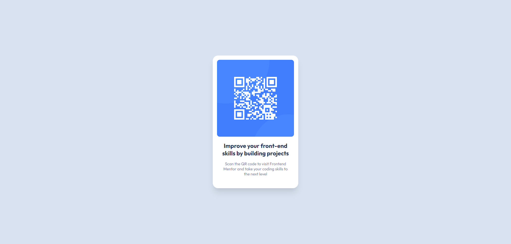

# Frontend Mentor - QR code component solution

This is a solution to the [QR code component challenge on Frontend Mentor](https://www.frontendmentor.io/challenges/qr-code-component-iux_sIO_H). Frontend Mentor challenges help you improve your coding skills by building realistic projects. 

## Table of contents

- [Overview](#overview)
  - [Screenshot](#screenshot)
  - [Links](#links)
- [My process](#my-process)
  - [Built with](#built-with)
  - [What I learned](#what-i-learned)
  - [Useful resources](#useful-resources)

**Note: Delete this note and update the table of contents based on what sections you keep.**

## Overview

### Screenshot

### Links

- Solution URL: [go to my solution](https://github.com/sittshein/qr-code-component-challenge)
- Live Site URL: [go to live site](https://qr-code-component-challenge-seven.vercel.app/)

## My process

### Built with

- Semantic HTML5 markup
- CSS custom properties
- Flexbox
- [Less](https://lesscss.org/) - Leaner Style Sheets

### What I learned

While working through this project, firstly I have learnt Less.js features likes (variables, mixins, nesting). It was fun writing css using less and I have more control over my css class and properties. Secondly, I gained some experinece and basic knowledge about Figma UI design tool.

### Useful resources

- [LESSCSS](https://lesscss.org/) - Official website for Less.js.
- [Figma | Dev Mode](https://www.figma.com/dev-mode/) - This article helped me understand how to work with figma files from you VSCode. I'd recommend it to anyone still learning this concept.
